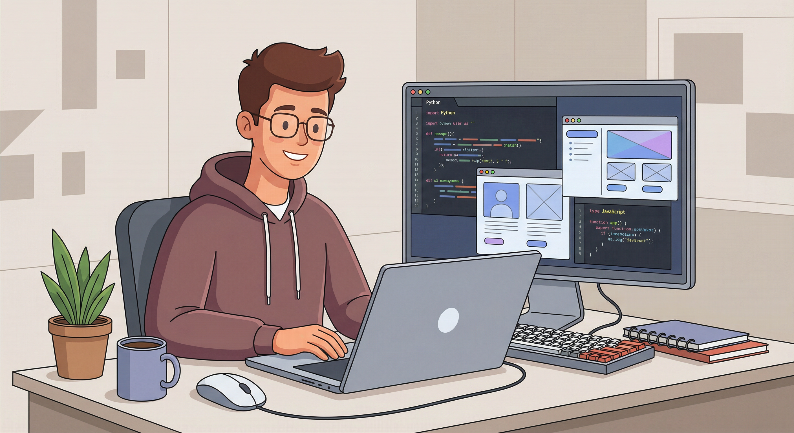

# Hi, I'm Dhanush Mendru 👋

### Frontend Developer · Hyderabad, India

---

## About Me

I'm a **frontend developer** with a focus on building clean, responsive interfaces. I'm currently expanding into **full-stack development** and enjoy turning ideas into polished user experiences.

- 🌱 **Learning:** Full-stack development
- 💬 **Happy to talk about:** Python, CSS, HTML, and frontend best practices
- 🏅 **Recent achievement:** Reached the **Champions Milestone** in the Google Cloud Arcade Program 2024

---

## Skills Summary

*Technologies and practices I use to ship quality software—from idea to deployment.*

 

**Core stack**

  
  
  
  
  
  
  
  
  
  

 

**Development & design**

- **Languages:** Python · JavaScript · SQL  
- **Frontend:** HTML5, CSS3, Bootstrap, React.js  
- **Backend & data:** MySQL, PostgreSQL  
- **Version control:** Git, GitHub  
- **Tools:** Visual Studio Code, Figma, Android Studio, Canva  

**Method & mindset**

- **Concepts:** Object-oriented programming (OOPs), SDLC, debugging, manual testing  
- **How I work:** Analytical thinking, problem solving, clear communication, team collaboration, adaptability, time management

---

## Connect With Me

  

**[LinkedIn](https://linkedin.com/in/dhanushme/)** · Open to collaboration and new opportunities

